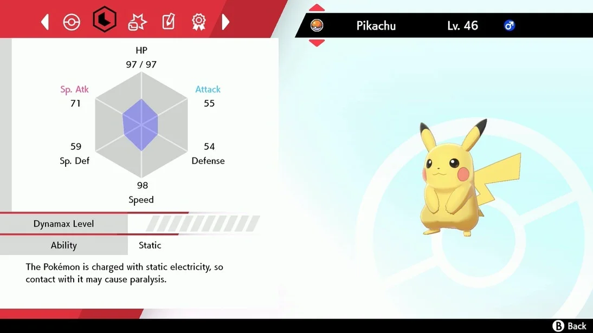

```{r setup, include=FALSE}
knitr::opts_chunk$set(echo = TRUE,
                      eval = TRUE,
                      error = FALSE,
                      message = FALSE,
                      warning = FALSE,
                      comment = NA)
```

# 1. Getting started

Today we will learn about `plotly`, an R package that allows you to **build interactive graphs**. 

To illustrate, we'll be working with a dataset that contains the information of all **801 Pokémon** in the world! Every Pokémon species has its own characteristics when it comes to height, weight, attack power, defense power, hit points (stamina)... **Gotta analyze’em all!**

<div align="center">
<br>

</div>

---

```{r, echo = TRUE}
# Please install the Rokemon package
# Make sure you have the "devtools" package, if not, install it first.

###install.packages("devtools")
###library(devtools)

devtools::install_github("schochastics/Rokemon")

# Load the packages
library(Rokemon) # contains data set
library(plotly) # focus of our tutorial
library(tidyverse) # to filter data set
library(dplyr) # additional functions
library(ggplot2) # for comparison 

# Data set
pokemon <- pokemon # Gotta analyze’em all!
```

---
# 2. Plotly vs Ggplot

- Ggplot provides meaningful, appealing, but _static_ graphs. This limits the users' possibilities to analyse the data.

- Plotly allows users to _interact_  with graphs on a wide variety of forms: zoom in/out of the plot, hover over a point, filter categories, among others.

- Interactive graphs are useful for having a deeper understanding of the patterns of data.

<div align="center">

<br>
<i>accurate image of your brain on plotly</i>
</div>

---

# 3. Examples

## 3A. Using ggplot

Let's take a closer look at the differences by mapping out the relationship between Pokémon's **attack and speed stats** with `ggplot`. 

<details>
  <summary>
  Code
  </summary>
.details[.code120[
```{r, eval=TRUE, message=FALSE, warning=FALSE, echo=TRUE, fig.width=5, fig.height=4}
pok3a <- ggplot(pokemon, aes(x=attack, y=speed, )) +
  geom_point(shape=1, alpha=0.5) +   
  ggtitle("Fig. 3A: Attack vs Speed ", subtitle = "Built with Ggplot") +
  labs(y="Attack", 
       x = "Speed", 
  caption = "Source: Pokemon")+
  theme_minimal()
```
]]
</details>

<details>
  <summary>
  Plot
  </summary>
.details[.code120[
```{r, message=FALSE, warning=FALSE, fig.width=7, fig.height=5, fig.align='center', echo=FALSE}
pok3a
```
]]
</details>

If we wanted to now add each Pokémon's **name** to the plot, it would look like this...

---
# 3. Examples

## 3B. Adding names in ggplot

The results are hard to read.

<details>
  <summary>
  Code
  </summary>
.details[.code120[
```{r, eval=TRUE, message=FALSE, warning=FALSE, echo=TRUE, fig.width=5, fig.height=4}
pok3b <- ggplot(pokemon, aes(x=attack, y=speed, label= name)) +
  geom_point(shape=1, alpha=0.5) +
  geom_text(size=3, hjust=1, vjust=1) +
  ggtitle("Fig. 3B: Attack vs Speed ", subtitle = "Built with Ggplot") +
  labs(y="Attack", 
       x = "Speed", 
  caption = "Source: Pokemon")+
  theme_minimal()
```
]]
</details>


<details>
  <summary>
  Plot
  </summary>
.details[.code120[
```{r, message=FALSE, warning=FALSE, fig.width=7, fig.height=5, fig.align='center', echo=FALSE}
pok3b
```
]]
</details>

---
# 3. Examples

## 3C. Using plotly
`plotly` allows the user to **hover over the individual observations**
and see hover text corresponding to the point on the plot.

<details>
  <summary>
  Code
  </summary>
.details[.code120[
```{r, eval=TRUE, message=FALSE, warning=FALSE, echo=TRUE, fig.width=5, fig.height=4}
pok3c <- pokemon%>%
  plot_ly(x = ~attack, y = ~speed, type = 'scatter', mode = 'markers',text=~name,
          marker=list(color="blue", size=10))%>%
  layout(title= "Fig. 3C: Attack vs Speed",
         xaxis = list(title = list(text = 'Speed')),
         yaxis = list(title = list(text = 'Attack')))

```
]]
</details>


<details>
  <summary>
  Plot
  </summary>
.details[.code120[
```{r, message=FALSE, warning=FALSE, fig.width=7, fig.height=5, fig.align='center', echo=FALSE}
pok3c
```
]]
</details>

Now, you can see each Pokémon's name without clutter. 

---
# 3. Examples

## 3D. Adding more elements to plotly

This graph allows us to map the Pokémon by the game they first appeared in (otherwise known as the variable `generation`).

<details>
  <summary>
  Code
  </summary>
.details[.code120[
```{r, eval=TRUE, message=FALSE, warning=FALSE, echo=TRUE, fig.width=5, fig.height=4}
pok3d_df <- pokemon
pok3d_df$generation <- as.character(pok3d_df$generation)

# pokemon_gen13$is_legendary[pokemon_gen13$is_legendary == "1"] <- "Legendary"
# pokemon_gen13$is_legendary[pokemon_gen13$is_legendary == "0"] <- "Not legendary"

pok3d <- pok3d_df %>%
  plot_ly(x = ~attack, y = ~speed, color =~generation,
          type = 'scatter', mode = 'markers', text= ~name,
          colors = c("#D64E12", "#F9A52C", "#EFDF48", "#8BD346", "#60DBE8", "#16A4D8", "#9B5FE0")) %>%
  layout(title= "Fig. 3D: Attack vs Speed",
         xaxis = list(title = list(text = 'Speed')),
         yaxis = list(title = list(text = 'Attack')))

```
]]
</details>


<details>
  <summary>
  Plot
  </summary>
.details[.code120[
```{r, message=FALSE, warning=FALSE, fig.width=7, fig.height=5, fig.align='center', echo=FALSE}
pok3d
```
]]
</details>


`plotly` lets you filter observations by clicking on the legend.

---

# 4. Other type of cool plots

Besides scatterplots, you can also create other type of graphics in Plotly such as bubble charts, histograms, box plots, among others. Let's see some cool examples! 

Remember, you can be anything you want to be.

---

# 4. Other type of cool plots

## 4A. Bubble charts

Is there any correlation between capture rate and total stats average of Pokémon types?

<details>
  <summary>
  Code
  </summary>
.details[.code120[
```{r, eval=TRUE, message=FALSE, warning=FALSE, echo=TRUE, fig.width=5, fig.height=4}
pokemon_count <- pokemon %>%
  count(type1)

pokemon_sub <- pokemon %>%
  group_by(type1) %>%
  summarise(ave_capture = mean(capture_rate, na.rm=T), 
            ave_power = mean(base_total, na.rm = T))
  
pokemon_sub <- merge(pokemon_sub, pokemon_count, by = "type1")

type_colors <- c('#A8A77A', '#EE8130', '#6390F0', '#F7D02C', '#7AC74C','#96D9D6', '#C22E28', '#A33EA1', '#E2BF65', '#A98FF3', '#F95587', '#A6B91A', '#B6A136', '#735797', '#6F35FC', '#705746', '#B7B7CE', '#D685AD')

pok4a <- plot_ly(pokemon_sub, x = ~ave_power, y = ~ave_capture, 
                 hovertext = ~paste('</br> Name: ', type1,
                                    '</br> Number of Pkmn: ', n), 
                 type = 'scatter', mode = 'markers',
                 size = ~n, color = ~type1, colors = type_colors,
                 marker = list(opacity = 0.5, sizemode = 'diameter'))

pok4a <- pok4a %>% layout(title = 'Capture rate vs Base stats total per Pokémon Type',
         xaxis = list(title = list(text = 'Base stats total')),
         yaxis = list(title = list(text = 'Avergage Capture Rate')),
         showlegend = FALSE)
```
]]
</details>


<details>
  <summary>
  Plot
  </summary>
.details[.code120[
```{r, message=FALSE, warning=FALSE, fig.width=7, fig.height=5, fig.align='center', echo=FALSE, prompt=TRUE}
pok4a
```
]]
</details>

In this bubble chart, you can hover over the circles to see what Pokémon type it corresponds to and how many Pokémon belong to that type.

---
# 4. Other type of cool plots

## 4B. Histograms
Let's see how is the distribution of Pokémons' defense and attack stats.

<details>
  <summary>
  Code
  </summary>
.details[.code120[
```{r, eval=TRUE, message=FALSE, warning=FALSE, echo=TRUE, fig.width=5, fig.height=4}
pok4b <- pokemon %>%
  plot_ly(alpha = 0.6) %>%
  add_histogram(x = ~defense,
                name = "Defense") %>% 
  add_histogram(x = ~attack,
                name = "Attack") %>% 
  layout(barmode = "overlay",
         title = "Histogram",
         xaxis = list(title = "Point Average",
                      zeroline = FALSE),
         yaxis = list(title = "Frequency",
                      zeroline = FALSE))
```
]]
</details>


<details>
  <summary>
  Plot
  </summary>
.details[.code120[
```{r, message=FALSE, warning=FALSE, fig.width=7, fig.height=5, fig.align='center', echo=FALSE}
pok4b
```
]]
</details>

Wow! Pokemons' defense and attack points also follow a normal distribution!

---
# 4. Other type of cool plots

## 4C. Box plots

This boxplot showcases on average how strong (variable `base_total`) the Pokémon in each generation of games are.

<details>
  <summary>
  Code
  </summary>
.details[.code120[
```{r, eval=TRUE, message=FALSE, warning=FALSE, echo=TRUE, fig.width=5, fig.height=4}
pok4c <- plot_ly(data = pokemon,
  y = ~base_total,
  x = ~generation,
  type = "box",
  showlegend = FALSE)
```
]]
</details>

<details>
  <summary>
  Plot
  </summary>
.details[.code120[
```{r, message=FALSE, warning=FALSE, fig.width=7, fig.height=5, fig.align='center', echo=FALSE}
pok4c
```
]]
</details>

Hover text reveals summary statistics for each group.

---

# 5. Building your first Plotly graph

## 5A. Let's get started!

There are two ways to do this:

- with the `plot_ly()` function
- with the `ggplot_ly()` function, which translates a ggplot into plotly

We're going to have a more in-depth look at the first option.

---
# 5. Building your first Plotly graph
## 5A. Let's get started!

_Let's say that I want to have a look at the Pokémon from the first Pokémon game, released
in 1996. My theory is that a Pokémon's hit points total is positively correlated with its defense stat, as a more protected, defensive Pokémon will last longer in battle._

- Choose the `type` argument within `plot_ly()` to determine what kind of plot you want
- Call variables with `~`
- For a full list of attributes and arguments that can be passed along in plotly, `schema()`

<details>
  <summary>
  Code
  </summary>
.details[.code120[
```{r, eval=TRUE, message=FALSE, warning=FALSE, echo=TRUE, fig.width=5, fig.height=4}
# cleaning data
pokemon_gen13 <- filter(pokemon, generation == "1")

# constructing our plotly graph
pok5a <- plot_ly(pokemon_gen13, x = ~defense, y = ~hp, type = 'scatter')
```
]]
</details>

---
# 5. Building your first Plotly graph
## 5A. Let's get started!
Visually, there does seem to be a positive correlation with these two statistics.
<details>
  <summary>
  Plot
  </summary>
.details[.code120[
```{r, message=FALSE, warning=FALSE, fig.width=7, fig.height=5, fig.align='center', echo=FALSE}
pok5a
```
]]
</details>

Let's make our plot better by introducing detail and plotly's signature feature, **hover text**.

---
# 5. Building your first Plotly graph

## 5B. Leveling up your plots
Something is about to evolve...

<details>
  <summary>
  Code
  </summary>
.details[.code120[
```{r, eval=TRUE, message=FALSE, warning=FALSE, echo=TRUE, fig.width=5, fig.height=4}
# cleaning data
pokemon_gen13 <- filter(pokemon, generation == "1")

pokemon_gen13$is_legendary[pokemon_gen13$is_legendary == "1"] <- "Legendary"
pokemon_gen13$is_legendary[pokemon_gen13$is_legendary == "0"] <- "Not legendary"

# constructing our plotly graph
pok5b <- plot_ly(pokemon_gen13, x = ~defense, y = ~hp,
               type = 'scatter',
               color = ~is_legendary, 
               colors = c('#BF382A', '#0C4B8E'),
               opacity = 0.5,
               hovertext = ~paste('</br> Name: ', name,
                             '</br> Species: ', classfication,
                             '</br> Type: ', type1, '/', type2)) %>% 
layout(title = "Hit points by Defense points",
  xaxis = list(title = list(text = 'Defense statistic')),
  yaxis = list(title = list(text = 'Hit points')))
```
]]
</details>


<details>
  <summary>
  Plot
  </summary>
.details[.code120[
```{r, message=FALSE, warning=FALSE, fig.width=7, fig.height=5, fig.align='center', echo=FALSE}
pok5b
```
]]
</details>

- `color()` allows you to create a legend for your plot.
- `colors()` assigns colors to your legend. Supports hexcodes, RBG values...
- `opacity()` modifies observation markers, useful if you have many overlapping ones.
- `hovertext()` is the big deal here. This option is very flexible, so please see plotly's documentation for the full scope of what it's capable of.
- `layout()` enables me to adjust the axis labels, but also supports many other arguments that modify your plot's final appearance. See [here](https://plotly.com/r/reference/#Layout_and_layout_style_objects) for a full list. 

---
# 5. Building your first Plotly graph

## 5C. What? Your scatterplot is evolving!

3D plots by adding a **z-axis**!

<details>
  <summary>
  Code
  </summary>
.details[.code120[
```{r, eval=TRUE, message=FALSE, warning=FALSE, echo=TRUE, fig.width=5, fig.height=4}
# cleaning data
pokemon_gen13 <- filter(pokemon, generation == "1")

pokemon_gen13$is_legendary[pokemon_gen13$is_legendary == "1"] <- "Legendary"
pokemon_gen13$is_legendary[pokemon_gen13$is_legendary == "0"] <- "Not legendary"


# constructing our plotly graph
pok5c <- plot_ly(pokemon_gen13, x = ~defense, y = ~hp, z = ~height_m,
               color = ~is_legendary, 
               colors = c('#BF382A', '#0C4B8E'),
               opacity = 0.5,
               hovertext = ~paste('</br> Name: ', name,
                             '</br> Species: ', classfication,
                             '</br> Type: ', type1, '/', type2)) %>% 
layout(title = "Hit points by Defense points by Height (in meters)",
  xaxis = list(title = list(text = 'Defense statistic')),
  yaxis = list(title = list(text = 'Hit points')))
```

]]
</details>


<details>
  <summary>
  Plot
  </summary>
.details[.code120[
```{r, message=FALSE, warning=FALSE, fig.width=7, fig.height=5, fig.align='center', echo=FALSE}
pok5c
```
]]
</details>

---

# 6. Some extras

## 6A. Exporting plotly graphs as static images

The `orca()` function allows you to do this, although it requires you to [download Orca](https://github.com/plotly/orca), an open source command line tool that interacts with plotly. You can transform your graphs into .jpegs, .pngs, .pdfs...


```{r, eval = FALSE, echo = TRUE}
library(orca)
orca(pok5b, "pok5b.png")
```

---
# 6. Some extras

## 6B. Transforming ggplot graphs into plotly

Yes, it's possible! The function `ggplotly()` allows you to do this.

<details>
  <summary>
  Plot
  </summary>
.details[.code120[
```{r, message=FALSE, warning=FALSE, fig.width=7, fig.height=5, fig.align='center', echo=FALSE}
pok3a
```
]]
</details>


---
# 6. Some extras

## 6B. Transforming ggplot graphs into plotly

```{r}
pok3ly <- pok3a %>% 
  style(hovertext = ~name) %>% 
  ggplotly()
```

<details>
  <summary>
  Plot
  </summary>
.details[.code120[
```{r, message=FALSE, warning=FALSE, fig.width=7, fig.height=5, fig.align='center', echo=FALSE}
pok3ly
```
]]
</details>

Some alterations are possible with `style()`. It may be better to build the graph natively in `plotly()` depending on your requirements.

---

# 7. Conclusion

-> The `plotly` package is a powerful data visualization tool which can bring your plots and graphs to life by making them more dynamic and interactive.

--

-> `plotly` is best used in an digital setting, such as in your browser, in order take full advantage of its functionality.

--

-> The simple function `plot_ly(dataset, x = ~xaxis, y = ~yaxis, type = 'plot')` will get you started with basic functionality. 

--

-> The `hovertext()` function allows you to modify information that is shown when hovering over a point. Many other customizations are possible, and the graph visualization can be adjusted via `layout()`.

--

-> Not every plot requires interactivity and bells and whistles. See what's the best fit for the story your data is trying to tell.

---
class:  center, middle

<b>With these tips, your plots will be the very best, like no plot ever was!</b><br>
Now, let's train our plotly skills.

---

# 8. References and Sources

* [Interactive web-based data visualization with R, plotly, and shiny](https://plotly-r.com)
* ['plotly' package documentation](https://cran.r-project.org/web/packages/plotly/plotly.pdf)
* ['plotly' package on GitHub](https://github.com/plotly)
* [Introduction to ggplot2](https://ggplot2.tidyverse.org/)
* [A Comparison of plot_ly and ggplotly for Interactive Graphs in R](https://jtr13.github.io/spring19/community_contribution_group17.html)
* ['Rokemon' package on GitHub](https://github.com/schochastics/Rokemon)

<div align="center">
<br>
<i>snorlax wishes you good luck on
all of your plotting adventures.</i>
</div>
